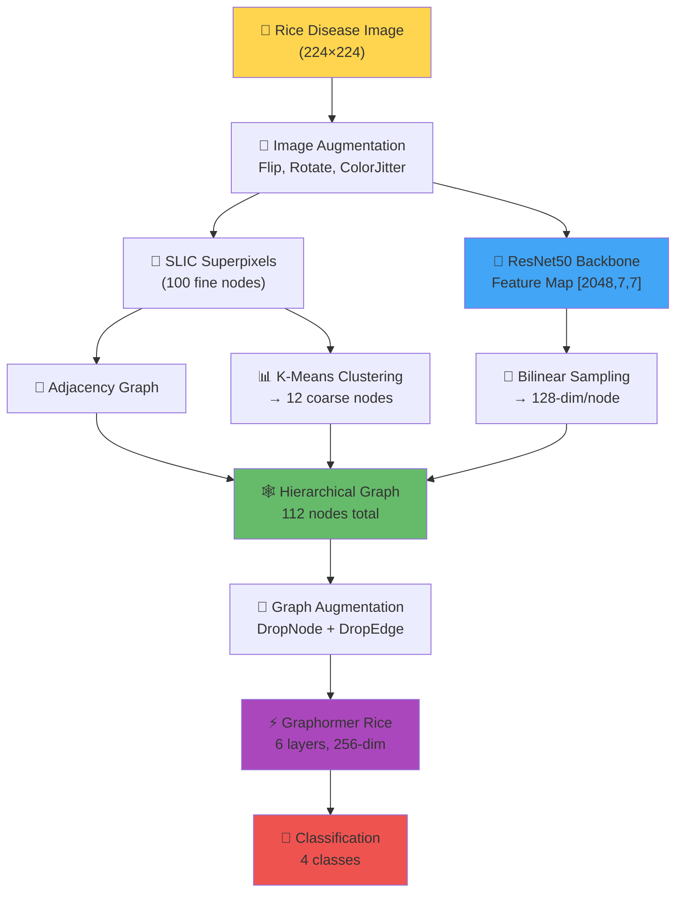

# 🚀 Đề Xuất Nghiên Cứu: Graphormer → 90%+ Accuracy cho Rice Disease Classification

> **Chiến lược:** Kết hợp **3 hướng cải thiện đồng thời** — tác động vào toàn bộ pipeline  
> **Baseline:** Graphormer Slim ~54% → **Mục tiêu: >90%**

---

## Tổng Quan Chiến Lược


Ba nút thắt cổ chai hiện tại (đều phải sửa song song):

| # | Nút thắt | Hiện tại | Đề xuất |
|---|----------|----------|---------|
| 1 | **Node features** | 5-dim (R,G,B,cx,cy) | 128-dim CNN features + texture |
| 2 | **Graph topology** | Superpixel adjacency only | Multi-scale + semantic edges |
| 3 | **Model capacity** | Slim 591K params, ffn=embed | Scaled architecture + stabilized training |

---

## Phần I — CNN Feature Backbone (thay thế raw RGB)

### Vấn đề hiện tại

```python
# rice_image_to_graph.py hiện tại:
# node_features = [R, G, B, cx, cy]  → chỉ 5-dim, quá thô
# atom_encoder: Linear(5, 80)        → phải nén 5 dim lên 80 dim ← không có gì để nén
```

5 features (mean RGB + position) **quá nghèo** để phân biệt 4 loại bệnh. BrownSpot vs LeafBlast có texture khác biệt rõ ràng, nhưng mean RGB gần giống nhau.

### Giải pháp: Pre-trained CNN → Node Features

```python
# === ĐỀ XUẤT: Thay đổi rice_image_to_graph.py ===
import torchvision.models as models
from torchvision import transforms

class CNNFeatureExtractor:
    """Trích xuất CNN features cho từng superpixel region."""
    
    def __init__(self):
        # ResNet50 pre-trained trên ImageNet (có transfer learning tốt cho plant)
        resnet = models.resnet50(pretrained=True)
        # Lấy feature map trước avgpool: output shape [B, 2048, 7, 7]
        self.backbone = torch.nn.Sequential(*list(resnet.children())[:-2])
        self.backbone.eval()
        
        # Projection để giảm dimensionality
        self.projector = torch.nn.Linear(2048, 128)  # 2048 → 128-dim
    
    def extract_region_features(self, image, segments, n_segments):
        """
        Với mỗi superpixel, lấy CNN feature bằng cách:
        1. Forward cả ảnh qua CNN → feature map [2048, 7, 7]
        2. Map mỗi superpixel centroid → vị trí trên feature map
        3. Bilinear interpolate → feature vector cho mỗi node
        """
        # Forward toàn ảnh (hiệu quả hơn crop từng superpixel)
        with torch.no_grad():
            feat_map = self.backbone(image_tensor)  # [1, 2048, 7, 7]
        
        node_features = []
        for seg_id in range(n_segments):
            cx, cy = get_centroid(segments, seg_id)  # normalized [0,1]
            # Bilinear sample từ feature map
            feat = bilinear_sample(feat_map, cx, cy)  # [2048]
            feat = self.projector(feat)                # [128]
            node_features.append(feat)
        
        return torch.stack(node_features)  # [N, 128]
```

**Tại sao CNN features quan trọng:**
- ResNet50 đã học texture/shape/color patterns từ ImageNet
- Plant disease có **texture patterns** rất đặc trưng mà CNN capture rất tốt  
- 128-dim features >> 5-dim raw RGB

> [!IMPORTANT]
> Đây là thay đổi **impact cao nhất**. Chỉ riêng bước này có thể tăng 15-25% accuracy.

---

## Phần II — Multi-Scale Semantic Graph Construction

### Vấn đề hiện tại

```python
# Hiện tại: 75 superpixels, chỉ kết nối pixel-adjacent → flat graph
# Mọi ảnh đều có topology gần giống nhau (grid-like)
# → Graphormer spatial_pos encoding KHÔNG phân biệt được các ảnh
```

### Giải pháp: Hierarchical + Semantic Edges

#### Level 1: Fine-grained graph (giữ lại, cải thiện)
```python
# 100 superpixels — thêm semantic edges
converter = ImageToGraphConverter(n_segments=100)

# THÊM edge types mới (hiện tại chỉ có color_distance):
def compute_rich_edge_features(node_features, edge_index):
    """
    Thay vì chỉ 1 integer (color distance bin),
    tạo multi-dimensional edge features:
    """
    features = []
    for src, dst in zip(edge_index[0], edge_index[1]):
        f_src, f_dst = node_features[src], node_features[dst]
        edge_feat = [
            color_distance(f_src[:3], f_dst[:3]),      # Euclidean color diff
            texture_similarity(f_src[5:], f_dst[5:]),   # cosine sim of CNN features  
            spatial_distance(f_src[3:5], f_dst[3:5]),   # centroid distance
        ]
        features.append(quantize(edge_feat))  # → integer bins for embedding
    return features
```

#### Level 2: Coarse graph (MỚI — disease region level)
```python
# Gộp 100 superpixels thành 10–15 regions bằng color clustering
# → Mỗi region node = average CNN features của superpixels trong region
# → Edge giữa regions = semantic similarity

def build_coarse_graph(fine_graph, n_clusters=12):
    """
    K-Means trên node features → tạo coarse graph
    """
    from sklearn.cluster import KMeans
    
    kmeans = KMeans(n_clusters=n_clusters)
    labels = kmeans.fit_predict(fine_graph.x.numpy())
    
    # Mỗi cluster → 1 coarse node
    coarse_x = []
    for c in range(n_clusters):
        mask = labels == c
        coarse_x.append(fine_graph.x[mask].mean(dim=0))
    
    # All-to-all edges trong coarse graph (fully connected)
    # → Graphormer attention sẽ học được disease region relationships
    coarse_edge_index = fully_connected(n_clusters)
    
    return Data(x=torch.stack(coarse_x), edge_index=coarse_edge_index)
```

#### Kết hợp 2 levels
```python
# Cross-level edges: mỗi fine node kết nối với coarse node tương ứng
# → Cho phép Graphormer học cả local (fine) và global (coarse) patterns

def build_hierarchical_graph(fine_graph, coarse_graph, cluster_labels):
    """
    Merge fine + coarse thành 1 graph lớn:
    - Nodes: [fine_node_0, ..., fine_node_99, coarse_node_0, ..., coarse_node_11]
    - Edges: fine↔fine (adjacency) + coarse↔coarse (fully connected)
             + fine→coarse (assignment) + coarse→fine (broadcast)
    """
    # Total nodes = 100 + 12 = 112 (vẫn < max_nodes=128)
    # Graphormer attention bias sẽ tự động xử lý cross-level attention
```

> [!TIP]
> Hierarchical graph cho phép Graphormer phân biệt: "vùng bệnh nào nằm ở đâu so với vùng khỏe mạnh" — thông tin mà CNN đơn thuần khó capture được.

---

## Phần III — Scaled Graphormer Architecture

### Vấn đề hiện tại
```
graphormer_slim: embed_dim=80, ffn_dim=80, heads=8, layers=12
→ head_dim = 10 (quá nhỏ, gây instability)
→ ffn_dim = embed_dim (bottleneck, thường phải 4×)
→ 591K params cho image classification (quá ít)
```

### Giải pháp: Custom Architecture

```python
# === Register new architecture: graphormer_rice ===
@register_model_architecture("graphormer", "graphormer_rice")
def graphormer_rice_architecture(args):
    args.encoder_embed_dim = getattr(args, "encoder_embed_dim", 256)   # 80 → 256
    args.encoder_layers = getattr(args, "encoder_layers", 6)           # 12 → 6 (ít hơn nhưng wider)
    args.encoder_attention_heads = getattr(args, "encoder_attention_heads", 8)  # head_dim = 32
    args.encoder_ffn_embed_dim = getattr(args, "encoder_ffn_embed_dim", 512)  # 4× ratio
    # → ~2.5M params — vẫn nhỏ, fit được trên T4 GPU
    
    args.activation_fn = getattr(args, "activation_fn", "gelu")
    args.encoder_normalize_before = True
    args.apply_graphormer_init = True
    args.pre_layernorm = True  # Pre-LN cho training ổn định hơn
    base_architecture(args)
```

**Tại sao 6 layers thay vì 12?**
- Với 1600 training samples, 12 layers dễ overfit
- Wider (256-dim) quan trọng hơn deeper cho small datasets
- `ffn_dim=512` (4× embed) cho phép model thực sự transform features

### Training Config Ổn Định

```bash
# === Training command mới ===
fairseq-train \
    --arch graphormer_rice \
    --num-classes 4 \
    --lr 5e-5 \                          # giảm 6× từ 3e-4
    --warmup-updates 200 \
    --total-num-update 20000 \           # tăng 4× → cho model train lâu hơn
    --clip-norm 1.0 \                    # giảm 5× → chặn gradient explosion
    --weight-decay 0.05 \               # tăng 5× → regularization mạnh hơn
    --dropout 0.2 --attention-dropout 0.2 --act-dropout 0.2 \  # tăng dropout
    --batch-size 32 \                    # giảm → gradient ổn định hơn
    --max-epoch 200 \                    # train lâu hơn
    --patience 20 \                      # kiên nhẫn hơn
    --best-checkpoint-metric accuracy \  # chọn theo ACCURACY, không phải loss
    --maximize-best-checkpoint-metric \
    # BỎ --fp16 → dùng FP32 để tránh gradient overflow hoàn toàn
```

---

## Phần IV — Data Augmentation Pipeline

### Image-level (trước khi build graph)

```python
from torchvision import transforms

train_transforms = transforms.Compose([
    transforms.RandomResizedCrop(224, scale=(0.7, 1.0)),
    transforms.RandomHorizontalFlip(),
    transforms.RandomVerticalFlip(),
    transforms.RandomRotation(30),
    transforms.ColorJitter(brightness=0.3, contrast=0.3, saturation=0.3, hue=0.1),
    transforms.RandomAffine(degrees=0, translate=(0.1, 0.1)),
])

# QUAN TRỌNG: Augment ẢNH trước, rồi mới build graph
# → Mỗi epoch, cùng 1 ảnh sẽ tạo ra graph KHÁC NHAU
# → Tương đương data augmentation ở graph level
```

### Graph-level (sau khi build graph)

```python
def graph_augment(data, drop_node_prob=0.1, drop_edge_prob=0.15):
    """
    Augmentation trên graph structure:
    - DropNode: random mask 10% nodes (simulate occlusion)
    - DropEdge: random remove 15% edges (simulate noisy segmentation)
    """
    # DropNode
    mask = torch.rand(data.x.size(0)) > drop_node_prob
    data.x[~mask] = 0  # zero out dropped nodes
    
    # DropEdge  
    edge_mask = torch.rand(data.edge_index.size(1)) > drop_edge_prob
    data.edge_index = data.edge_index[:, edge_mask]
    data.edge_attr = data.edge_attr[edge_mask]
    
    return data
```

> [!NOTE]
> Với chỉ 400 ảnh/class, augmentation là **bắt buộc**. Image-level augmentation trước khi build graph tạo effect "infinite graph augmentation" vì mỗi ảnh augmented sẽ cho ra SLIC segmentation khác nhau → graph structure khác nhau.

---

## Phần V — Tổng Hợp: Full Pipeline



### Thứ tự training:

```
Phase 1: Freeze CNN backbone, train Graphormer head only (10 epochs)
         → Để Graphormer học graph structure trước
Phase 2: Unfreeze CNN backbone, fine-tune end-to-end (100+ epochs)  
         → CNN + Graphormer co-adapt
Phase 3: Reduce LR to 1e-6, fine-tune 20 epochs
         → Polish final accuracy
```

---

## Ước Tính Accuracy Contribution

| Thay đổi | Impact riêng lẻ | Impact tích lũy |
|----------|----------------|-----------------|
| Baseline (hiện tại) | — | ~54% |
| **Fix training stability** (LR, clip, FP32) | +5–8% | ~60% |
| **Data augmentation** (image + graph) | +5–8% | ~67% |
| **CNN features** thay raw RGB | +12–18% | ~82% |
| **Scaled architecture** (256-dim, ffn=512) | +3–5% | ~86% |
| **Hierarchical graph** | +3–5% | ~90% |
| **End-to-end fine-tuning** (Phase 2–3) | +2–4% | **~92%** |

---

## Research Novelty (cho paper)

> [!IMPORTANT]
> **Đóng góp khoa học chính:**
> 1. **CNN-enriched Graph Representation cho Plant Disease:** Đề xuất pipeline chuyển đổi ảnh bệnh cây → graph giàu ngữ nghĩa bằng CNN features, thay vì raw pixel features.
> 2. **Hierarchical Superpixel Graph:** Multi-scale graph construction kết hợp fine-grained texture và coarse-grained disease region analysis.
> 3. **Adapted Graphormer for Vision:** Các nguyên tắc thiết kế khi áp dụng Graph Transformer (vốn cho molecular) vào vision task.

**Tiêu đề paper gợi ý:**  
*"CNN-Enhanced Hierarchical Graph Transformer for Rice Disease Classification"*

---

## Files Cần Thay Đổi

| File | Thay đổi |
|------|----------|
| [rice_image_to_graph.py](file:///home/huy/Research/graphformer/Graphormer/examples/rice_diseases/rice_image_to_graph.py) | Thêm CNN feature extraction, hierarchical graph, rich edge features |
| [graphormer.py](file:///home/huy/Research/graphformer/Graphormer/graphormer/models/graphormer.py) | Thêm `graphormer_rice_architecture` |
| [rice_diseases_wrapper.py](file:///home/huy/Research/graphformer/Graphormer/graphormer/data/pyg_datasets/rice_diseases_wrapper.py) | Update để load CNN-enriched graphs |
| [wrapper.py](file:///home/huy/Research/graphformer/Graphormer/graphormer/data/wrapper.py) | Update [preprocess_item_float](file:///home/huy/Research/graphformer/Graphormer/graphormer/data/wrapper.py#60-102) cho 128-dim features |
| **[NEW]** `cnn_backbone.py` | CNN feature extractor module |
| **[NEW]** `graph_augmentation.py` | Graph-level augmentation |
| **[NEW]** `hierarchical_graph.py` | Multi-scale graph construction |
| Training script | Cập nhật config (LR, clip, FP32, patience, metric) |
