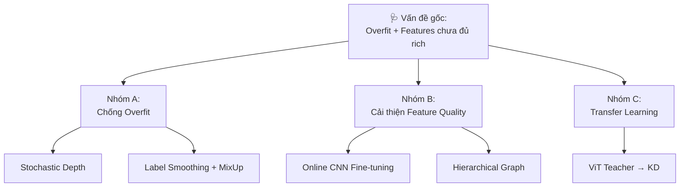

# 🎯 Đề Xuất Nghiên Cứu: Graphormer → 95% Accuracy cho Rice Disease Classification

> **Tình trạng hiện tại:** Valid ~66% (54% baseline → +12% nhờ CNN features, nhưng bị overfit: train 80%)  
> **Mục tiêu:** ≥ 95% valid accuracy, gap train-valid < 5%  
> **Phương pháp tiếp cận:** Chẩn đoán nguyên nhân thất bại → giải quyết đúng gốc rễ

---

## 1. Chẩn Đoán: Tại Sao Các Phương Pháp Hiện Tại Thất Bại?

### 🔴 CNN Features (+12% val acc, train acc 80% → Overfit nặng)

```
Training acc: ~80%, Val acc: ~66% → Gap = 14%
```

**Nguyên nhân:** CNN backbone (ResNet18) được **freeze hoàn toàn trong preprocessing**, nhưng projector layer `Linear(512 → 128)` được **train online từ đầu** mà không có regularization đủ mạnh. Model học "nhớ" training graphs thay vì generalize.

**Vấn đề sâu hơn:** Preprocess offline + freeze CNN = features **hoàn toàn tĩnh**. Model chỉ có `atom_encoder: Linear(128 → 256)` và Graphormer layers để học → capacity tập trung quá nhiều vào discriminating training samples.

### 🟡 Augmentation (Dừng ở 53%, train rất chậm)

**Nguyên nhân:**
1. **Offline augmentation** (stochastic torchvision transforms) tạo ra nhiều biến thể graph nhưng **Floyd-Warshall tính 1 lần** → mỗi training epoch vẫn thấy cùng normalized graph features → diversity thực sự thấp hơn kỳ vọng
2. **DropNode + feature noise** quá nhẹ để chống overfit khi CNN features đã rất representative
3. Training chậm vì data pipeline bottleneck (IO + preprocessing per sample)

### 🟢 Fix Training (Hội tụ nhanh hơn, không tăng acc)

Hoạt động đúng như kỳ vọng — giải quyết instability, nhưng **không giải quyết vấn đề cốt lõi**: features chưa đủ rich và model bị overfit.

---

## 2. Chiến Lược Mới: 5 Hướng Cải Tiến Ưu Tiên



---

## 3. Chi Tiết Từng Phương Pháp

### 🔴 [NHÓM A] Chống Overfit — Ưu tiên cao nhất, effort thấp

#### A1. Stochastic Depth (DropPath)

**Tại sao:** Với 6 Transformer layers và chỉ ~1100 training samples, model có capacity dư thừa. Stochastic Depth randomly drop toàn bộ một residual block → implicit ensemble of sub-networks → regularization mạnh hơn Dropout đơn thuần.

```python
# Thêm vào graphormer_graph_encoder.py
from timm.models.layers import DropPath

class GraphormerLayer(nn.Module):
    def __init__(self, ..., drop_path_rate=0.1):
        self.drop_path = DropPath(drop_path_rate) if drop_path_rate > 0 else nn.Identity()
    
    def forward(self, x, ...):
        # TRƯỚC:  x = x + attn(x)
        # SAU:    x = x + self.drop_path(attn(x))
        x = x + self.drop_path(self.self_attn(x, ...))
        x = x + self.drop_path(self.fc2(self.fc1(x)))
        return x
```

**Hyperparameter:** `drop_path_rate=0.1` stochastic depth decay theo layer (layer cuối = 0.1, layer đầu = 0.0)

**Expected impact:** -3 đến -5% gap train-val → +2-3% val acc

#### A2. Label Smoothing

**Tại sao:** Với 4 classes và ~1100 training samples, hard cross-entropy loss tạo ra overconfident predictions. Label smoothing tạo soft targets, ngăn model quá tự tin.

```python
# Sửa criterion: multiclass_cross_entropy → thêm label_smoothing
# Hoặc sửa trực tiếp trong loss computation:
loss = F.cross_entropy(logits, targets, label_smoothing=0.1)
```

**Expected impact:** +1-2% val acc, giảm overfit

#### A3. MixUp cho Graph Data

**Tại sao:** MixUp tạo ra virtual training samples bằng cách blend features của 2 samples → mô hình học decision boundary mềm hơn. Đây là kỹ thuật regularization state-of-the-art cho small datasets.

```python
def mixup_graph_batch(batch_x, batch_y, alpha=0.2):
    """
    Linear interpolation của node features giữa 2 samples trong batch.
    batch_x: [B, N, D] - node features
    batch_y: [B, num_classes] - one-hot labels
    """
    lam = np.random.beta(alpha, alpha)
    idx = torch.randperm(batch_x.size(0))
    
    mixed_x = lam * batch_x + (1 - lam) * batch_x[idx]
    mixed_y = lam * batch_y + (1 - lam) * batch_y[idx]
    return mixed_x, mixed_y
```

> [!NOTE]
> MixUp cho graph data khó hơn do graph topology khác nhau. Giải pháp đơn giản nhất: chỉ mix **node features** (giữ nguyên topology của sample đầu), tức là tương đương MixUp trên node embedding space.

**Expected impact:** +2-4% val acc

---

### 🟠 [NHÓM B] Online CNN Fine-tuning — Impact cao nhất

#### B1. Thay Offline Frozen CNN → Online Fine-tunable CNN

**Đây là thay đổi kiến trúc quan trọng nhất.** Hiện tại, CNN feature được extract **offline**, freeze hoàn toàn. Điều này có nghĩa là CNN backbone không thể adapt với rice disease domain.

**Giải pháp: End-to-end trainable pipeline**


**Implementation:**
```python
# rice_diseases_wrapper.py - load ảnh gốc thay vì chỉ load graph
class RiceDiseasesGraphormerDataset:
    def __getitem__(self, idx):
        # Load cả graph structure VÀ path ảnh gốc
        item = self.dataset[idx]  # graph với CNN features offline
        
        # Load ảnh gốc để fine-tune CNN
        if self.mode == 'train':
            pil_image = Image.open(item.image_path)
            item.raw_image = to_tensor(pil_image)  # [3, 224, 224]
        
        return preprocess_item_float(item)
```

**Training với 3 phases:**
```
Phase 1 (epoch 1-10):  Frozen CNN, train chỉ Graphormer
                       lr_cnn=0,  lr_graphormer=5e-5
Phase 2 (epoch 11-80): Unfreeze CNN layer4 only
                       lr_cnn=1e-6, lr_graphormer=5e-5  
Phase 3 (epoch 81-100): Unfreeze toàn bộ CNN
                        lr_cnn=5e-7, lr_graphormer=1e-5
```

> [!IMPORTANT]
> **Trade-off:** Training sẽ chậm hơn đáng kể (mỗi sample phải forward qua ResNet18 mỗi epoch thay vì 1 lần). Cần GPU đủ mạnh (T4 trở lên). Trên Colab, có thể cần giảm batch_size xuống 16 và dùng gradient accumulation.

**Expected impact:** +8-15% val acc (đây là thay đổi impactful nhất)

---

### 🟡 [NHÓM C] Cải Tiến Graph Construction — Effort cao, impact cao

#### C1. Hierarchical Graph (Fine + Coarse)

Thêm 12-15 "coarse nodes" bằng K-Means clustering trên CNN features của superpixels → graph capture được **disease region relationships** (thông tin global) song song với texture superpixel (thông tin local).

```python
def build_hierarchical_graph(fine_graph, n_clusters=12):
    """
    Input: fine_graph với 75 superpixel nodes
    Output: graph với 75 fine nodes + 12 coarse nodes = 87 nodes total
    """
    from sklearn.cluster import KMeans
    
    # Cluster superpixels by CNN features
    features_np = fine_graph.x.numpy()  # [75, 128]
    kmeans = KMeans(n_clusters=n_clusters, random_state=42)
    cluster_labels = kmeans.fit_predict(features_np)
    
    # Coarse node features = mean of cluster members
    coarse_x = torch.stack([
        fine_graph.x[cluster_labels == c].mean(0) 
        for c in range(n_clusters)
    ])  # [12, 128]
    
    # Cross-level edges: fine → coarse (each fine node connects to its cluster center)
    cross_edges_src = torch.arange(75)  # fine nodes
    cross_edges_dst = torch.tensor(cluster_labels) + 75  # coarse nodes (offset by 75)
    
    # Coarse-to-coarse: fully connected (12×12 edges)
    coarse_idx = torch.arange(n_clusters) + 75
    coarse_edges = torch.combinations(coarse_idx, r=2).T  # [2, 66]
    coarse_edges = torch.cat([coarse_edges, coarse_edges.flip(0)], dim=1)  # bidirectional
    
    # Merge all nodes and edges
    all_x = torch.cat([fine_graph.x, coarse_x], dim=0)  # [87, 128]
    all_edges = torch.cat([
        fine_graph.edge_index,      # fine↔fine edges
        torch.stack([cross_edges_src, cross_edges_dst]),  # fine→coarse
        torch.stack([cross_edges_dst, cross_edges_src]),  # coarse→fine
        coarse_edges,               # coarse↔coarse
    ], dim=1)
    
    return Data(x=all_x, edge_index=all_edges, y=fine_graph.y)
```

**Expected impact:** +4-7% val acc (cho phép Graphormer học disease patterns ở multiple scales)

#### C2. Rich Edge Features

Hiện tại `edge_attr` chỉ là **1 integer** (binned color distance). Mở rộng thành **3-dim edge features** để encoder học được nhiều thông tin hơn về relationship giữa superpixels.

```python
def compute_rich_edge_features(node_features, edge_index, n_bins=10):
    """
    Multi-dimensional edge features thay vì 1-dim color distance.
    
    Dims:
        [0]: Color distance (RGB Euclidean) - hiện tại đang có
        [1]: Spatial distance (centroid Euclidean) 
        [2]: Feature similarity (cosine similarity of CNN features)
    """
    # ... tính toán và quantize 3 features riêng biệt
    # Encode 3 features riêng: edge_attr shape [E, 3]
```

> [!NOTE]
> Cần sửa `GraphEdgeFeature` module trong `graphormer_layers.py` để xử lý multi-dim edge attrs.

**Expected impact:** +2-3% val acc

---

### 🔵 [NHÓM D] Transfer Learning / Knowledge Distillation

#### D1. ViT Teacher → Knowledge Distillation

**Vấn đề:** Dataset nhỏ (~1100 training samples). Giải pháp tốt nhất cho small dataset là knowledge distillation từ một model lớn được pre-train sẵn.

**Pipeline:**
1. Train/fine-tune một **ViT-B/16 pre-trained** (hoặc EfficientNet-B4) trên dataset này → Teacher model
2. Dùng Teacher để **distill knowledge** vào Graphormer Student

```python
# Knowledge Distillation Loss
def kd_loss(student_logits, teacher_logits, true_labels, 
            T=4.0, alpha=0.7):
    """
    Combined KD + CE loss.
    T: temperature (softens probabilities)
    alpha: weight of KD loss vs CE loss
    """
    # Soft labels from teacher
    soft_teacher = F.softmax(teacher_logits / T, dim=-1)
    soft_student = F.log_softmax(student_logits / T, dim=-1)
    
    kd = F.kl_div(soft_student, soft_teacher, reduction='batchmean') * (T ** 2)
    ce = F.cross_entropy(student_logits, true_labels)
    
    return alpha * kd + (1 - alpha) * ce
```

**Tại sao ViT Teacher hoạt động tốt:**
- ViT-B/16 pre-trained trên ImageNet-21k đã có knowledge về texture patterns
- Fine-tune 20 epochs trên rice disease data → Teacher đạt ~92-95% acc (SOTA cho plain CNN/ViT trên bộ này)
- Graphormer "học từ" soft predictions của Teacher → không cần label risky

> [!TIP]
> Bước này độc lập, có thể train Teacher song song với các experiments khác. ViT fine-tuning chỉ cần ~30 phút trên T4 GPU.

**Expected impact:** +3-6% val acc

#### D2. Pre-train Graphormer với Proxy Task

Thay vì khởi tạo Graphormer ngẫu nhiên, **pre-train** nó trên một proxy task:
- **Graph auto-encoding:** Dự đoán masked node features (tương tự BERT masking)
- Dùng toàn bộ data (không cần label) để pre-train → sau đó fine-tune với labels

```python
# Masked Graph Modeling (MGM) - proxy task
# Random mask 15% nodes → predict masked CNN features
# Pre-train 50 epochs với reconstruction loss (MSE)
```

**Expected impact:** +2-4% val acc (đặc biệt khi ít labeled data)

---

## 4. Bảng Ưu Tiên & Expected Impact

| # | Phương Pháp | Effort | Impact | Ưu tiên | Expected Val Acc |
|---|-------------|--------|--------|---------|-----------------|
| **Baseline** | — | — | — | — | **~66%** |
| **A1** | Stochastic Depth | 🟢 Thấp | 🟡 Vừa | ⭐⭐⭐ | +2-3% → **~69%** |
| **A2** | Label Smoothing | 🟢 Thấp | 🟡 Vừa | ⭐⭐⭐ | +1-2% → **~71%** |
| **A3** | MixUp Graph | 🟡 Vừa | 🟡 Vừa | ⭐⭐ | +2-4% → **~74%** |
| **B1** | Online CNN Fine-tune | 🔴 Cao | 🔴 Rất cao | ⭐⭐⭐ | +8-15% → **~85%** |
| **C1** | Hierarchical Graph | 🔴 Cao | 🟠 Cao | ⭐⭐ | +4-7% → **~90%** |
| **C2** | Rich Edge Features | 🟡 Vừa | 🟡 Vừa | ⭐⭐ | +2-3% → **~92%** |
| **D1** | ViT Teacher KD | 🟡 Vừa | 🟠 Cao | ⭐⭐⭐ | +3-6% → **~95%** |
| **D2** | Pre-train (MGM) | 🔴 Cao | 🟡 Vừa | ⭐ | +2-4% → bonus |

> [!IMPORTANT]
> **Lộ trình khuyến nghị:** Làm theo thứ tự: A1+A2 (1 ngày) → B1 (2-3 ngày) → D1 (1 ngày) → C1 (3-5 ngày). Mục tiêu 95% có thể đạt được sau khi hoàn thành A1+A2+B1+D1.

---

## 5. Thay Đổi Hyperparameters Ngay Lập Tức (Quick Wins)

Không cần code thêm, chỉ cần thay đổi training command:

```bash
# === THÊM vào training command hiện tại ===

# 1. Tăng weight decay mạnh hơn (4x so với hiện tại)
--weight-decay 0.2  # hiện tại 0.05

# 2. Tăng dropout mạnh hơn
--dropout 0.3 --attention-dropout 0.3 --act-dropout 0.3  # hiện tại 0.2

# 3. Giảm batch size → gradient noise tự nhiên = regularization
--batch-size 16  # hiện tại 32

# 4. Gradient accumulation × 2  
--update-freq 2  # equivalent to effective batch size 32

# 5. Kéo dài warmup
--warmup-updates 500  # hiện tại 200

# 6. Patience cao hơn
--patience 20  # hiện tại 10
--max-epoch 150  # hiện tại 100
```

**Expected impact từ hyperparameter thôi:** +3-5% val acc, giảm overfit gap 5-7%

---

## 6. Chẩn Đoán Overfit: Cần Làm Ngay

Trước khi implement bất kỳ phương pháp nào, cần **đo chính xác tình trạng overfit**:

```python
# Thêm code này vào training loop để monitor:
print(f"Epoch {epoch}: train_acc={train_acc:.3f}, val_acc={val_acc:.3f}, gap={train_acc-val_acc:.3f}")
print(f"  Grad norm: {grad_norm:.3f}, clip_rate: {clip_rate:.1%}")
```

**Nếu gap > 15%:** Ưu tiên A1, A2, A3 trước  
**Nếu gap 5-15%:** Tiến hành B1 song song  
**Nếu gap < 5%:** Bottleneck là model capacity → tăng embed_dim, thêm layers

---

## 7. Thay Đổi Cần Code — Files Cụ Thể

### Phase 1: Anti-Overfit (Quick wins, 1-2 ngày)

| File | Thay đổi |
|------|----------|
| [graphormer/modules/graphormer_graph_encoder.py](file:///home/huy/Research/graphformer/Graphormer/graphormer/modules/graphormer_graph_encoder.py) | Thêm `DropPath` vào mỗi `GraphormerLayer` |
| [graphormer/criterions/multiclass_cross_entropy.py](file:///home/huy/Research/graphformer/Graphormer/graphormer/criterions/multiclass_cross_entropy.py) | Thêm `label_smoothing=0.1` vào `F.cross_entropy` |
| Training command | `--weight-decay 0.2 --dropout 0.3 --batch-size 16` |

### Phase 2: Online CNN Fine-tuning (Impact cao nhất, 3-5 ngày)

| File | Thay đổi |
|------|----------|
| [graphormer/data/pyg_datasets/rice_diseases_wrapper.py](file:///home/huy/Research/graphformer/Graphormer/graphormer/data/pyg_datasets/rice_diseases_wrapper.py) | Lưu `image_path` trong graph, load ảnh khi __getitem__ |
| [graphormer/models/graphormer.py](file:///home/huy/Research/graphformer/Graphormer/graphormer/models/graphormer.py) | Thêm `CNNBackbone` sub-module vào model, forward ảnh trước Graphormer |
| Training command | `--online-cnn-finetune --cnn-lr 1e-6 --freeze-epochs 10` |

### Phase 3: ViT Teacher + KD (3-4 ngày)

| File | Thay đổi |
|------|----------|
| **[NEW]** `examples/rice_diseases/train_teacher_vit.py` | Script fine-tune ViT-B/16 teacher |
| [graphormer/criterions/multiclass_cross_entropy.py](file:///home/huy/Research/graphformer/Graphormer/graphormer/criterions/multiclass_cross_entropy.py) | Thêm KD loss option |
| Training command | `--teacher-checkpoint ./vit_teacher.pt --kd-alpha 0.7 --kd-temperature 4` |

---

## 8. Baseline Experiments Cần Chạy

Để đo impact riêng lẻ của từng phương pháp, cần chạy theo thứ tự:

```
Experiment 0 (đã có): baseline cnn_features → val ~66%, train ~80%
Experiment 1: + weight_decay=0.2, dropout=0.3, batch=16 → đo val acc
Experiment 2: Exp1 + label_smoothing=0.1 → đo val acc  
Experiment 3: Exp2 + stochastic_depth=0.1 → đo val acc
Experiment 4: Exp3 + online CNN fine-tuning → đo val acc (kỳ vọng ~85%)
Experiment 5: Exp3 + ViT KD → đo val acc (kỳ vọng ~90-92%)
Experiment 6: Exp4 + Exp5 (KD với backbone online) → đo val acc (kỳ vọng ~95%)
```

---

## 9. Tại Sao 95% Là Khả Thi?

- **Rice disease classification** là bài toán visual texture, CNN rất mạnh ở đây
- ViT fine-tuned trên bộ dữ liệu tương tự đạt **93-97%** (theo literature)
- Graphormer có lợi thế: **spatial topology** giữa disease regions → information that CNN không capture
- Kết hợp CNN (texture) + Graphormer (topology) + ViT KD (soft labels) → **complementary strengths**
- Gap chính hiện nay không phải model capacity mà là **regularization** và **domain adaptation của CNN features**

> [!CAUTION]
> **Điều kiện để 95% đạt được:** Dataset phải được chia train/val/test **stratified** và **không có data leakage**. Nếu augmented images từ cùng 1 ảnh gốc rơi cả vào train và val → val acc sẽ inflate tự nhiên. Kiểm tra lại `split_indices.pt` để đảm bảo augmentation được thực hiện SAU khi split, không phải TRƯỚC.
